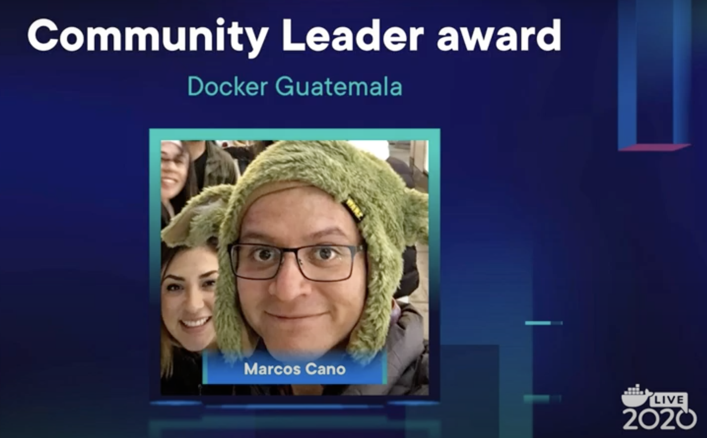
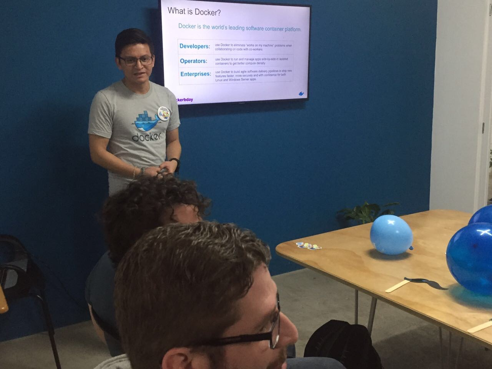

# Acerca de Mi - Marcos Cano

## Personal Info
Hola mi nombre es **Marcos Cano**.

Vivo actualmente en ==Ciudad de  Guatemala 🇬🇹=={>>Central America<<}
> Aqui se habla español

## Tengo el privilegio de ser [Docker Community Leader en Guatemala](https://www.meetup.com/Docker-Guatemala).

Desde 2017 tengo el honor de servir a la comunidad siendo Community Leader, no me hace mas especial pero si con la responsabilidad de compartir y facilitar el conocimiento a mas personas

En el año 2020 durante el DockerCon tuve el honor de ser premiado con "Community Leader Award"; por la pasión que siempre he tenido de esforzarme y compartir.

### A continuación ve nuestro meetup

???+ danger "DCA"
    Tambien soy Docker Certified Associate 🤓

??? info " 💵 Nos paga Docker?"
    Nop, pero lo hago con todo el gusto.

## Qué son las cosa que amo ❤️ ?

- Enseñar con pasiòn y compartir.
- Docker & Kubernetes
- El hacer todo con Docker y containers (cualquier proyecto lo que sea).
- Empoderar a otros a ser mejores.
- Tomar café ☕️ y todo lo que tenga que ver con café
- Música 🗒

## Algo de mi carrera profesional

- Senior Devops Engineer
- Devops Consultant and trainer.
- Docker Community Leader.
- He ayudado en varias ocasciones a modernizar aplicaciones y migrar monolitos a arquitectura de microservicios
- Me especializo en Docker:
    - CI/CD
    - Docker
    - Cloud Native
    - Infrastructura como código
- Tuve la increíble oportunidad de realizar varias publicaciones para la [IEEE](https://www.ieee.org/) y algunos compañeros de Francia y Guatemala, siempre usando Docker para realizar un emulador de redes mobiles (MANET) usando containers y mi "propio" orquestador de containers "Dockemu" (Docker + Emulator), este es mi [perfil de la IEEE](https://ieeexplore.ieee.org/author/37085420823)

Puedes ver mis redes sociales y seguirme en [linketree](https://linktr.ee/marcoscano)

