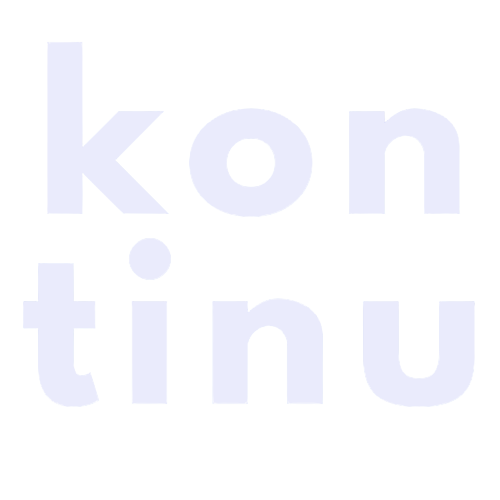
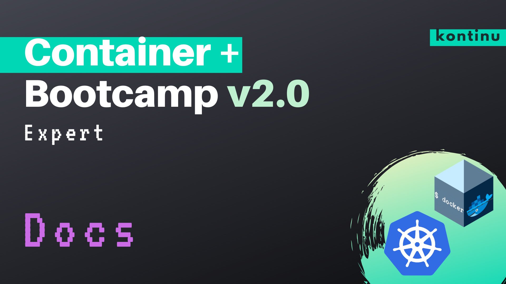

# Bienvenido 😃

??? success
    Gracias por confiar en [kontinu](https://www.kontinu.io) para tu crecimiento.

---

Si estas aqui con nosotros es porque hay un deseo en ti de crecer, superarte y ser mejor profesional.

A lo largo de 6 días, 3 horas diarias, 18 horas en total, estaremos en este bootcamp 🏋🏻‍♀️ en cual esperamos sea de provecho y beneficio para tu carrera profesional,

- [Docker 🐳](https://docker.com)
- [Kubernetes ☸️](https://kubernetes.io)
- Container Orchestrators 🎼
- Containers in General. 📦

??? info "Agenda 🗓"
    Encuentra la agenda semanal en esta [página](./extras/agenda.md)
---

# Cursos

Estare lanzando próximamente cursos en Udemy, debido a que varias personas nos indicaron que "Les gustaría recibir estos cursos a su propio ritmo"
