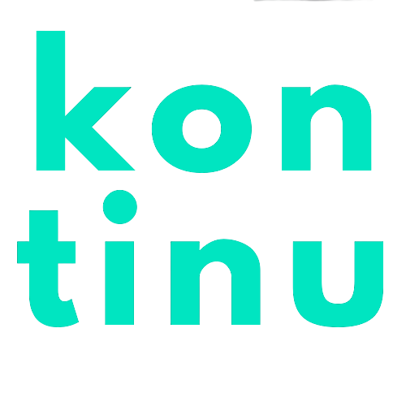

## Bienvenido 😃

??? success
    Gracias por confiar en [kontinu](https://www.kontinu.io) para tu crecimiento.

---

Si estas aqui con nosotros es porque hay un deseo en ti de crecer, superarte y ser mejor profesional.

A lo largo de 6 días, 3 horas diarias, 18 horas en total, estaremos en este bootcamp 🏋🏻‍♀️ en cual esperamos sea de provecho y beneficio para tu carrera profesional.

## Agenda Semanal 🗓

| [Semana 1](semana1/topics.md)                                                                                                                                                                            	|                                                                                [Semana 2](semana2/topics.md)                                                                                	|
|: -------------------------------------------------------------------------------------------------------------------------------------------------------------------------------------	|:----------------------------------------------------------------------------------------------------------------------------------------------------------------------	|
| [**Día 1**](semana1/d1.md)       - Docker basics       - Integracion de Docker con nuestra app       - Ambientes de desarrollo local                                                     	| [**Día 4**](semana2/d4.md)        - Intro a kubernetes       - Objetos de Kubernetes       - Traduccion de nuestra app en Docker a Kubernetes       - Deploy hacia kubernetes. 	|
| [**Día 2**](semana1/d2.md)        - CI/CD con Docker       - Deploy en ambientes Single Engine       - Introduccion a Cloud Native Apps       - Integración de Docker con Cloud Native Apps 	| [**Día 5**](semana2/d5.md)        - Kubernetes Extras y add-ons       - Storage Tier       - Manejo de Stateful apps en Kubernetes.       - Más objetos de kubernetes.         	|
| [**Día 3**](semana1/d3.md)        - Docker Swarm       - Creación de un ambiente production ready con Swarm       - Deployment Lifecycle de nuestra app                                   	| [**Día 6**](semana2/d6.md)        - Kubernetes app lifecycle via Helm       - Kubernetes Operators.                                                                        	|

<!-- 
=== "Semana 1"
    ### [**Semana 1**](semana1/topics.md)

    [**Día 1**](semana1/d1.md)

    - Docker basics
    - Integracion de Docker con nuestra app
    - Ambientes de desarrollo local

    [**Día 2**](semana1/d2.md)

    - CI/CD con Docker
    - Deploy en ambientes Single Engine
    - Introduccion a Cloud Native Apps
    - Integración de Docker con Cloud Native Apps

    [**Día 3**](semana1/d3.md)

    - Docker Swarm
    - Creación de un ambiente production ready con Swarm
    - Deployment Lifecycle de nuestra app

=== "Semana 2"
    ### [**Semana 2**](semana2/topics.md)

    [**Día 4**](semana2/d4.md)

    - Intro a kubernetes
    - Objetos de Kubernetes
    - Traduccion de nuestra app en Docker a Kubernetes
    - Deploy hacia kubernetes.

    [**Día 5**](semana2/d5.md)

    - Kubernetes Extras y add-ons
    - Storage Tier
    - Manejo de Stateful apps en Kubernetes.
    - Más objetos de kubernetes.

    [**Día 6**](semana2/d6.md)

    - Kubernetes app lifecycle via Helm
    - Kubernetes Operators.
 -->

??? info "Agenda 🗓"
    Si desea ver la agenda compartida anteriormente[página](./extras/agenda.md)
---

## Cursos 📚

Estare lanzando próximamente cursos en Udemy, debido a que varias personas nos indicaron que "Les gustaría recibir estos cursos a su propio ritmo"
