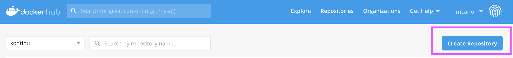
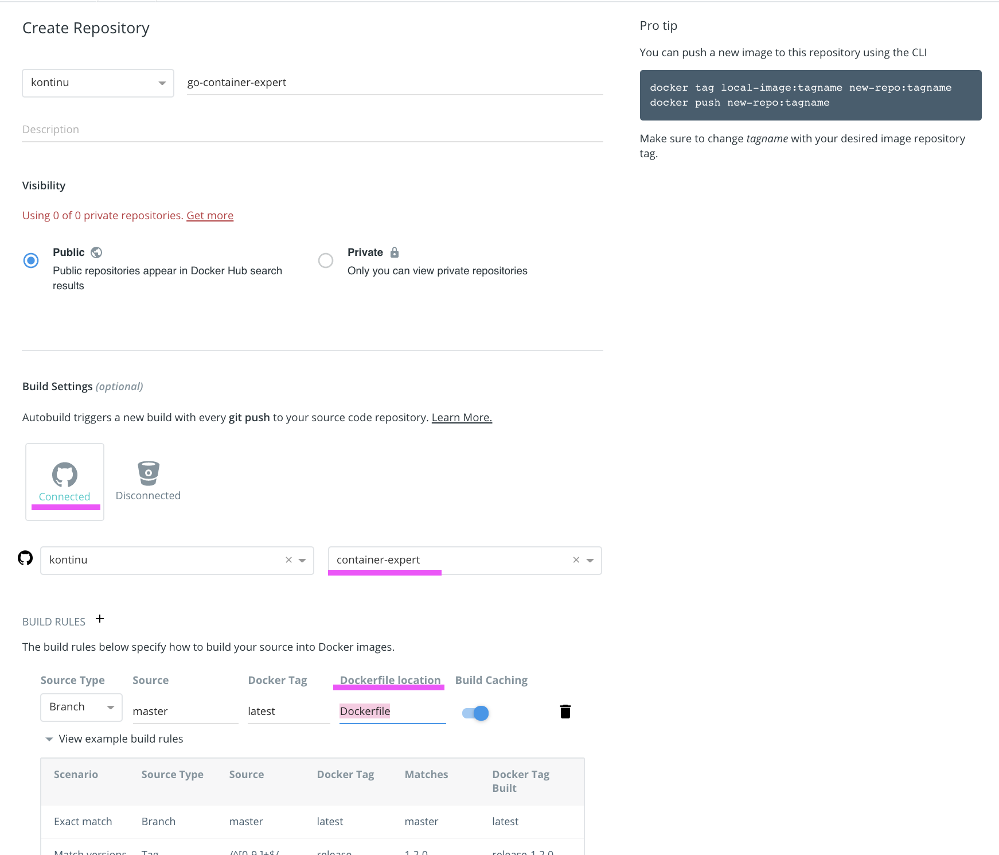
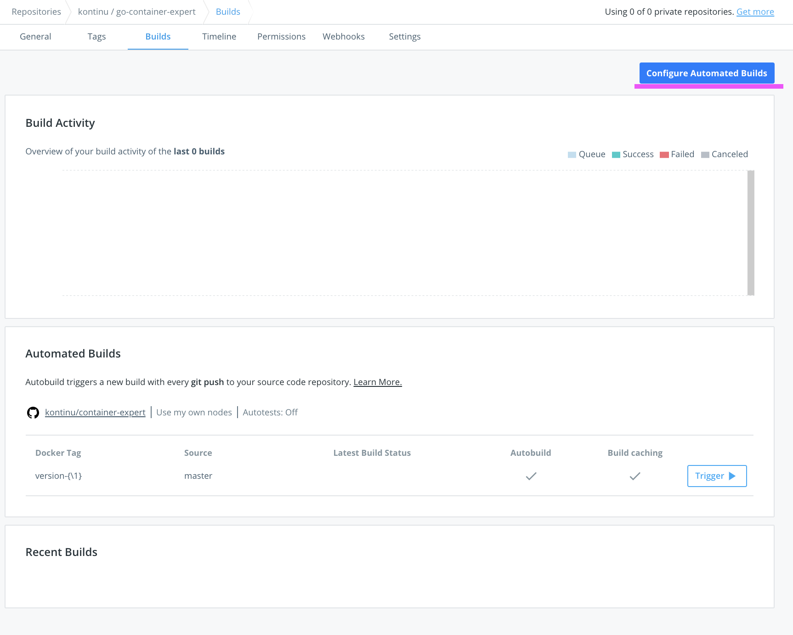
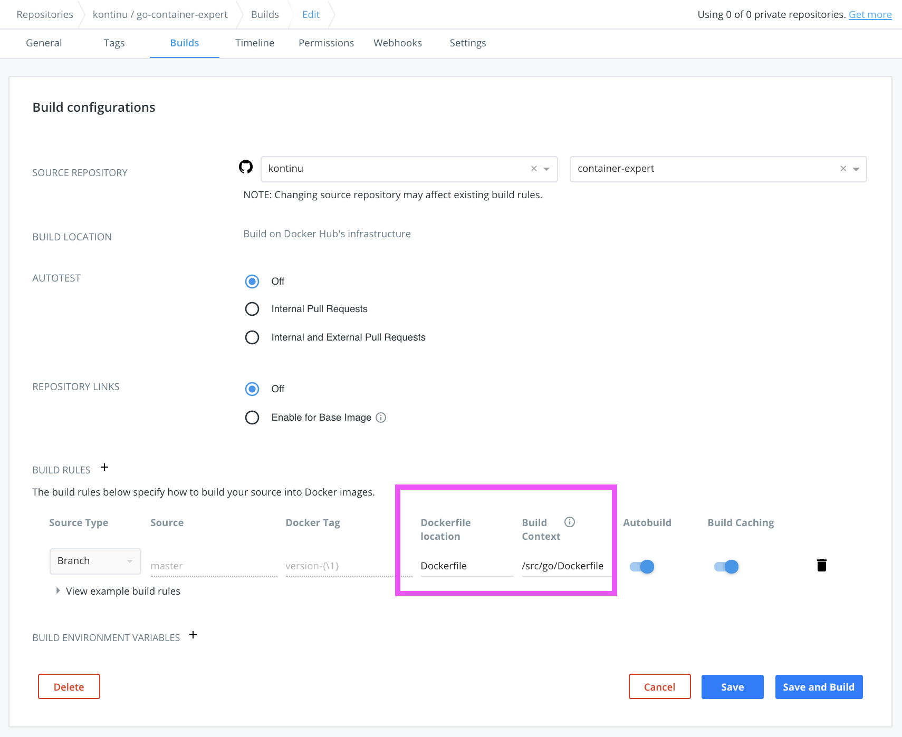
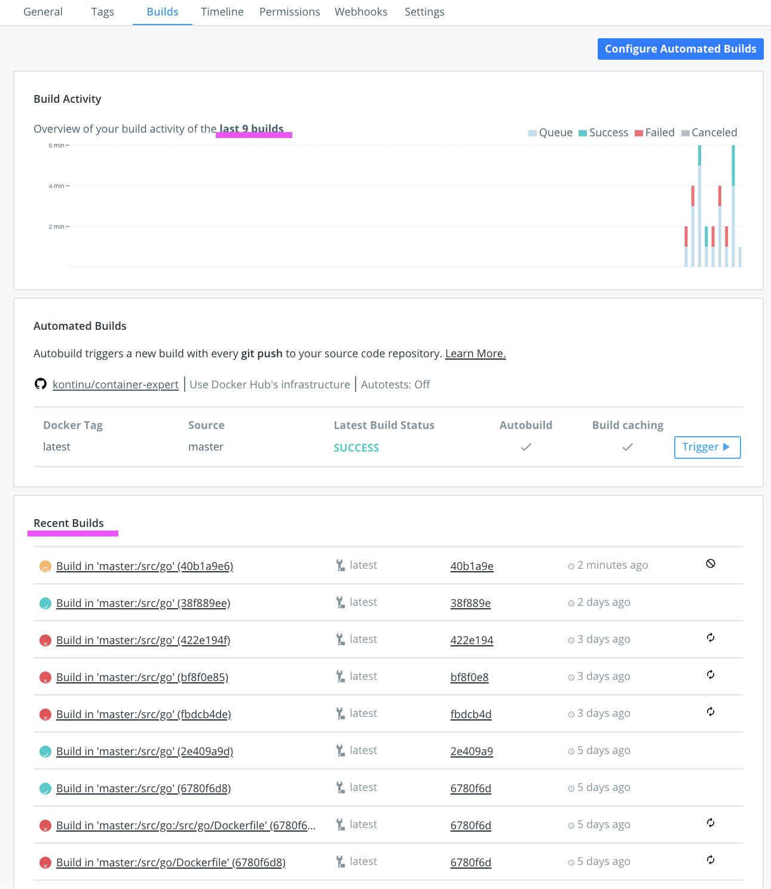

# Continuous Integration

???+ info
    BONUS

Docker Hub provee una forma de hacer [CI](https://docs.docker.com/docker-hub/builds/) en su infrastructura de una manera automatizada. Esto es que permite construir las imagenes automaticamente.

<!-- TODO: change to mermaid-->
Github commit => Docker Hub Build =>  new Docker image tag

## 0. Enlaza tu cuenta de github

Previo a todo debes configurar [esto](https://docs.docker.com/docker-hub/builds/link-source/#link-to-a-github-user-account)

## 1. Crea un nuevo Repositorio

En tu cuenta de Docker hub crea un nuevo repositorio

## 2. Nombre de repositorio y conectalo con un Git repository

## 3. Configura Builds Automaticos

## 4. Cambia Build Context

Y si gustas tag format

## 5. Disfruta de builds automaticos

